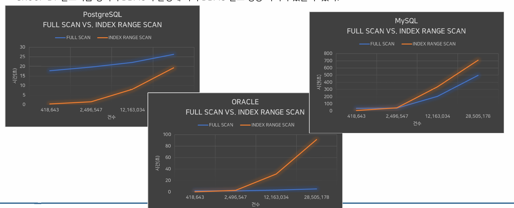
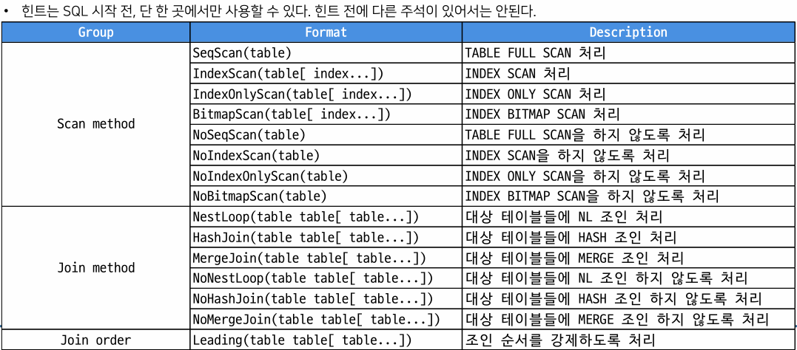
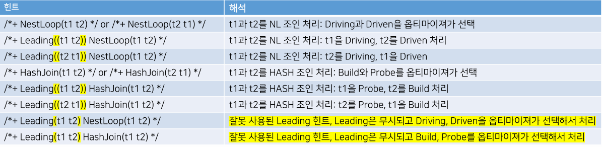

## SQL 튜닝이란?
- SQL의 비효율을 제거하는 작업 = 조금 더 직접적으로 표현하면, 불필요한 접근을 제거하는 것이다.
- MySQL 이나 MariaDB, PG(PostgreSQL)에서 대량의 데이터를 오라클처럼 간단한 힌트만으로 성능을 개선하기는 쉽지 않다.


## SQL 성능 개선의 주요 요소
- 성능 개선을 위해서는 `INDEX`, `비효율 SQL 변경`, `힌트 사용` 의 세 개 요소를 균형 있게 적용 필요
  - 가장 중요하게 생각할 부분은 `비효율 SQL을 작성하지 않는 것`

## SQL 처리 과정
- Parsing > Optimization > Execution > Fetch

## Execution Plan 과 Optimizer
- 사용자가 실행한 SQL 의 효율적인 실행계획을 만드는 모듈
- PG 에서는 옵티마이져 대신 `쿼리플래너`란 용어를 사용하기도 한다.
- 비용 기반 옵티마이져`Cost-Based Optimizer`
  - 비용 계산을 위해 `통계 정보`를 이용한다.


- 옵티마이져가 실행계획을 만드는 작업은 비교적 큰 비용`CPU연산`이 든다.
  - 비용 기반 옵티마이져는 효율적인 실행계획을 만들기 위해 `최대한` 노력
    - `최대한 != 최적`


- 실행계획의 재사용
  - `오라클`은 실행계획을 만드는데 비교적 많은 시간을 사용하고, 만들어진 실행계획을 재사용 할 수 있도록 구성되어 있다.
    - `Library Cache` 사용
  - `MySQL`, 이나 `MariaDB`, `PG` 는 세션 레벨에서만 실행계획을 재사용 하는 것으로 알려져 있다.
    
## 통계
> 통계는 비용 기반 옵티마이저가 실행계획을 생성하는 데 매우 큰 영향을 미칩니다.  
> 하지만 통계가 정확하다고 해서 항상 좋은 실행계획이 만들어지는 것은 아니며,  
> 통계가 부정확하다고 해서 반드시 나쁜 실행계획만 나오지도 않습니다.


## IO
- SQL 성능 개선의 핵심은 IO다.
  - SQL 에서 불필요한 IO가 발생하고 있다면, 불필요한 IO를 제거하는 것이 바로 성능 개선의 핵심이다.

### 블록
- DB 내부적으로 데이터를 읽고 쓰는 최소한의 단위. IO의 최소 단위다.
- MySQL, MS SQL Server 의 경우 블록 대신 페이지란 용어를 사용한다.

## 물리적IO와 논리적IO
- 디스크에서 데이터를 읽어오는 것을 `물리적IO(Physical IO)`라 하고, 메모리에서 데이터를 읽어오는 것을 `논리적 IO(Logical IO)`라고 한다.
- 메모리는 디스크에 비해 비싸고 제한적인 자원이다. 그러므로 무작정 메모리를 늘려서 DB를 사용할 수는 없다.
  - 적절한 메모리를 확보하는 것도 중요하지만, 제대로 작성한 SQL 과 적절한 인덱스가 우선이다.

## EXPLAIN
- Operation`오퍼레이션`
  - 실행계획은 여러 단계의 오퍼레이션으로 구성되어 있다.
  - PostgreSQL 실행계획에서 각각의 오퍼레이션은 화살표`->`로 구분된다.
> 실행계획은 처리 과정을 트리 형태로 보여주는 것일 뿐, 정확한 처리 순서를 포함해 보여주는 것은 아니다.
- 실행 계획 흐름 해석
  - 기본적으로 부모보다는 자식 먼저

## EXPLAIN OPTION
- ANALYZE
  - 실제 쿼리를 수행하고 사용한 실행계획을 보여준다
  - MySQL 은 ANALYZE 에 CUD 가 작동하지 않지만, PG는 CUD가 작동
- BUFFERS
  - 쿼리 실행 중에 사용된 공유 버퍼, 로컬 버퍼, 그리고 쓰기 버퍼에 대한 정보
- COSTS
  - 각 계획 단계의 추정 비용, 기본적으로 활성화되어 있음
  - COST OFF 로 예상 비용 표시 제외 가능
- FORMAT
  - 결과를 다른 형식으로 반환
- VERBOSE
  - 실행계획에 출력 컬럼 정보도 포함

## INDEX
> 인덱스를 공부하는 가장 큰 이유는, 인덱스를 효율적으로 사용하는 SQL을 만들기 위해서다.  
> 그 다음이, SQL에 적합한 인덱스를 잘 만들기 위해서다.  
> 절대, 마구잡이로 인덱스를 만들기 위해서가 절대 아니다.

## B-TREE INDEX
- B-트리 인덱스는 인덱스로 지정된 컬럼의 값을 사용해 만들어지는 B-트리 자료 구조다.
- 루트 노드는 단 하나만 존재한다.
- 브랜치 노드는 여러층이 있을수 있으며 여러 노드가 존재할 수 있다.`실제 5단계 이상 있는 경우는 드물다`
- 리프에는 인덱스 키 값 별로 실제 데이터를 찾아갈 수 있는 주소 값이 존재한다.

## Heap 과 Clustered
- 관계형 데이터베이스에서 테이블은 `Heap` 구조 또는 `Clustered` 구조로 구성된다.

- Clustered 구조
  - 정의한 값을 기준으로 데이터를 정렬해서 관리하는 방식
  - 데이터 입력시마다, 정렬 순서를 고려해 데이터를 입력해야 하는 부담 존재
  - `MySQL`, `MariaDB`의 InnoDB 는 테이블을 무조건 클러스터드 구조로 관리'
  - `PostgreSQL`은 클러스터드 구조를 지원하지 않는다.
  - 오라클은 클러스터드와 같은 개념으로 IOT`Index-Organized Table`를 지원하지만, 실제 현장에서는 잘 사용하지 않는다.
- PostgreSQL 의 CLUSTER 명령어는 Clustered 구조와는 다르다.
  - CLUSTER 는 일회성 작업이며, 시간이 지날수록 데이터는 다시 흩어질 수 있다.
> 클러스터드 구조는 리프 노드에 실제 데이터가 저장  
> 리프 노드에 인덱스에 정의된 컬럼과 실제 데이터가 저장된 주소만 관리하는 인덱스를 넌-클러스터드 인덱스 라고도 한다
- `MySQL` 과 `MariaDB`의 `InnoDB`는 PK를 무조건 클러스터드 인덱스로 설정한다.

## 인덱스를 이용한 데이터 검색
- 1단계 `수직적 탐색`
 - 루트 노드에서 시작해 브랜치 노드를 차례로 거치며, `검색 범위의 시작 위치`가 될 리프 노드를 찾아가는 과정
- 2단계 `수평적 탐색`
  - `검색 범위의 시작 위치`부터 `검색 범위의 종료 취기`까지 리프 노드를 차례대로 스캔하는 과정
- 3단계 `테이블 접근`
  - 리프 노드를 차례대로 스캔(2단계)하면서, 리프 노드에 저장된 실제 데이터 주소를 참고해 테이블에 접근하는 과정

## 테이블에서 데이터를 찾는 세 가지 방법
### 1. `Seq Scan`
 - 테이블의 데이터 블록을 처음부터 끝까지 스캔하면서 필요한 데이터를 가져오는 방법
   - DBMS 별 실행계획
     - ORACLE : `TABLE ACCESS FULL`
     - PostgreSQL : `Seq Scan`
     - MySQL/MariaDB : `ALL`

### 2. 실제 주소로 접근
- 데이터가 실제 저장된 물리적 주소를 이용해 필요한 데이터를 가져오는 방법
  - DBMS 별 실행계획
    - ORACLE : TABLE ACCESS BY ROWID
    - PostgreSQL/MySQL/MariDB : 실행계획에 표현해주지 않는다
    - 개발자나 SQL 작성자가 직접적으로 사용할 방법은 아니다

### 3. Index Scan
- 인덱스를 활용해 필요한 데이터를 가져오는 방법
  - DBMS 별 실행계획
    - ORACLE : `INDEX RANGE SCAN`, `INDEX UNIQUE SCAN`, `INDEX SKIP SCAN`, `INDEX FULL SCAN`
    - PostgreSQL : `Index Scan`, `Index Only Scan`, `Bitmap Index Scan`

## PostgreSQL 의 인덱스를 활용한 데이터 검색 방법
- Index Scan
  - 가장 기본적인 인덱스를 활용한 데이터 검색
  - 수직적 탐색, 수평적 탐색, 테이블 접근 세 단계가 모두 동작한다.
- Index Only Scan
  - 테이블 접근이 발생하지 않고, 수직적 탐색과 수평적 탐색만 동작하는 데이터 검색
- Bitmap Index Scan
  - 기본적으로 Index Scan과 유사
  - 테이블 접근의 횟수를 줄이기 위해 접근해야 할 데이터의 주소를 비트맵 처리한 후에 해당 비트맵을 참고해 실제 데이터에 접근한다.
- Index Backward Scan
  - 기본적으로 Index Scan과 유사, 인덱스의 리프 노드를 뒤쪽에서 부터 검색하는 특징이 있다.
- Index Full Scan
  - PostgreSQL 은 해당 동작을 표현해 주지 않는다.
  - 내부적으로 이와 같은 방식으로 동작하는 것 같다고 유추만 할 수 있다.

## 언제나 INDEX 가 답인가?
> 넓은 범위 조건의 데이터를 모두 읽어야 하는 상황이라면 인덱스보다 TABLE FULL SCAN`Seq Scan`이 더 빠를 수 있다.


## 복합 인덱스
- 일반적으로 같다`=` 조건이 사용된 컬럼을 복합 인덱스의 앞쪽에 위치시켜야 한다.
> 같다`=` 조건이 사용된 컬럼을 복함 인덱스의 선두로  
> 공식만 외우는 것은 좋지 않다  
> 원리를 이해해보고, 상황에 따라서는 항상 그렇지 않다는 것도 반드시 기억하자  
> 특히, 하나의 인덱스로 여러 SQL을 커버한다면 유연한 생각을 발휘할 필요가 있다

## 복합 인덱스의 리프 탐색 범위
- SQL에서 복합 인덱스의 두 컬럼을 WHERE 절에서 모두 사용 중 일 때
  - 복합 인덱스의 선두 컬럼을 범위 조건으로 처리하고 있으면, 복합 인덱스의 후행 컬럼은 인덱스의 수직 탐색 조건에 관여하지 못한다.

## 복합 인덱스의 컬럼 순서
 - 일반적으로 같다`=`조건이 사용된 컬럼을 복합 인덱스의 앞쪽에 위치시켜야 한다.
 - 상황에 따라서는 항상 그렇지 않다는 것도 반드시 기억
 - 하나의 인덱스로 여러 SQL을 커버한다는 유연한 생각 필요


 - SQL 하나만 보고 인덱스 컬럼 순서를 결정할 순 없다.
 - 절대적으로 검색해야 할 데이터 자체가 많다면, 복합 인덱스가 큰 도움이 되지 않을 수도 있다.

> 정리. SQL 하나를 위한 인덱스는 큰 의미가 없다.  
> 가능한 많은 SQL 을 커버할 수 있는 인덱스 전략을 세워야 한다.  
> 단기간 프로젝트로는 현실적으로 어려운 경우가 많다.


## 커버링 인덱스
> 모든 SQL에 대해 커버할 수 있는 인덱스를 만든다면?  
> 조회성능에 도움이 되겠지만 데이터 CUD 작업에 부하가 걸리며, 너무 많은 인덱스는 여러가지 관리의 어려움이 있음.  
> 실전에서 커버링 인덱스 생성은 자제하는 것이 좋다.

## Partial Index
> PostgreSQL은 `Partial Index`를 제공, 특정 조건에 대해서만 인덱스를 구성하는 방법이다.
```sql
CREATE INDEX ms_mbr_big_x02 ON ms_mbr_big(mbr_st,mbr_gd) WHERE mbr_st = 'INAC'
```
- 조건에 명시한 값에 대해서만 인덱스를 구성하므로, 인덱스 크기가 작아지는 장점이 있다.

## external merge - Disk
- 조회 조건에 해당하는 데이터 정렬 `sort`가 발생하며, 정렬이 완료된 후에 결과를 내보낸다.
- 이때 메모리에서 정렬을 모두 처리하지 못하면 디스크 공간을 사용하고, 이 경우 성능 저하가 매우 클 수 있다.

## quicksort - Memory
- WORK_MEM
  - sort 를 처리하기 위해 세션별로 가지고 있는 메모리 공간
    - WORK_MEM의 공간이 부족하면, DISK영역에서 정렬이 발생하며, 이 경우 성능 저하가 많이 발생한다.
    - 반대로 WORK_MEM이 충분하다면, DISK 영역을 사용하지 않아 정렬을 빠르게 처리할 수 있다.

```sql
SHOW work_mem; -- DEFAULT 4MB
SET work_mem = '512mb';
```


# JOIN

## 조인의 내부 처리 방식
  - PostgreSQL 은 다음 세가지 알고리즘 중에 하나를 사용해 조인을 처리한다.
    - NESTED LOOPS JOIN`NL JOIN`
    - SORT MERGE JOIN`MERGE JOIN`
    - HASH JOIN

### NL JOIN
 - 관계형 DB 에서 가장 많이 사용되는 조인 방식
 - 중첩된 반복문 형태로 조인을 처리한다

 - DRIVING
   - 두 테이블을 조인할 때 주도적인 역할을 하는 테이블이다. DRIVING 테이블의 값을 DRIVEN 쪽으로 가져가 비교를 수행한다.
 - DRIVEN
   - 조인 과정에서 DRIVING 테이블이 접근해 검색되는 테이블
   - DRIVEN 은 조인 과정에서 이너 테이블이라고도 한다
 - NL 조인의 경우, DRIVING 을 선행, DRIVEN 을 후행 접근 테이블로 설명할 수 있다.

### HASH JOIN
 - 해시 함수를 통한 조인 방식
 - 일반적으로 대용량 데이터를 조인할 때 적합하다
 - 조인 조건에 사용할 적절한 인덱스가 없을 때 주로 사용되기도 한다

 - 해시 조인은 해시 테이블을 만들고`BUILD` 검증`PROBE` 하는 과정으로 조인을 처리한다
   - 보통 크기가 작은 데이터 집합을 BUILD로 고려한다

## HINT
> 힌트 사용시, 테이블 별칭을 반드시 소문자로 지정하고, 힌트에서도 테이블 별칭을 반드시 소문자로 사용해야 한다.  
> PG는 힌트를 SQL의 가장 상단이나 SELECT절 다음에, [/*+]와 [*/] 사이에 지정할 수 있다


 
